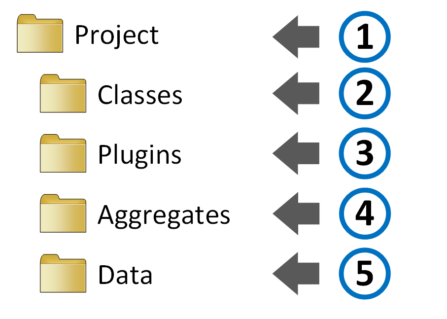

<!-- $theme: default -->

# G.Tool 

# 

### A Python-based DSL for managing information security governance information
</br>

 [/bsapiro](https://github.com/bsapiro)
 [@ironfog](https://twitter.com/ironfog)
 [sapiro](https://ca.linkedin.com/in/sapiro)

---
<!-- page_number: true -->
<!-- footer: G.Tool | PyCon Canada 2016 | CC BY-SA 4.0 -->
# Outline
- Backstory
- Overview
- Demo
- Ask for help

---
# TL;DR
G.Tool is an open source, batteries included, framework for non-programmer security types to build their own **GRC** (**G**overnance, **R**isk & **C**ompliance) tools without having to write code.

Source is here :arrow_right: https://github.com/gtoolframework/ 
Get started with: ```pip install gtool```

---
# Origin story
During my employer's first ever SOC2 compliance audit my team was managing evidence via Excel, storing hundreds of files on sharepoint and collaborating on control documentation in Word (auditors like office docs with weird specialized layouts). It did not go well...

---
# I had a problem
###### (actually I had several...)

* Office documents have varying levels of change tracking and varying levels of brokeness when doing collaborative editing on large documents
* Tracking hundreds of pieces of evidence without structure or tagging didn't work
* I had no budget for a commercial GRC tool (run rate matters at SaaS companies) and most GRC tools are overengineered / too expensive to own
* Even if I had the money, our IT department had a massive backlog and my team wasn't equipped to run servers
* Our auditors are "committed" to working in Excel and Word :expressionless:

---
# So I built my own purpose specific tool.

It was called **SOC2Tool** (our marketing department was busy that day)

---
# SOC2TOOL
* Principles, Controls, Risks and Evidence were documented in normal text files
* Changes tracking was provided by using GitHub enterprise 
* Hand crafted artisinal python code converted the data structure into auditor friendly Excel spreadsheets and Word documents (and packaged up evidence into massive zip files)
* Not open source (it would have not met my employer's quality standards for an opensource release)
* Tightly coupled with our specific business requirements
* Used YAML (people are not good at YAML) :disappointed:

---
blurry cam for the next few slides

---
# SOC2TOOL Workflow #1


---
# SOC2TOOL Workflow #2


---
# SOC2TOOL Workflow #3


---
# SOC2TOOL Workflow #4


---
<center>
<H1>A quick tour of G.Tool</H1>
</center>
 
---
#### G.Tool is a GRC tool framework with these design objectives:
* Accessible to non-developers and non-system admins
* Configuration and data entry using a simple text editor
* Works on any desktop operating system (no infrastructure)
* Supports collaborative editing (via Git or equivalent)
* Benefits from common tools in your environment
* Composable 
* Data structures work with existing operating system tools
* Data structure is accessible to other tools (without an API)
* Is extensible using plugins

---
#### G.Tool is a...
* command line tool
* framework (simple language and data structure) for users to create purpose specific GRC tools
* runs the tools created with framework

---
#### G.Tool folder structure


---
#### G.Tool processing workflow


<!-- read the configuration file, load plugins (global and project), Load data structures (/classes) load data aggregators /aggregates -->

---
*Release 1* of G.Tool was built to at least achieve parity with Excel oriented use cases (the defacto standard for GRC). 

---
# This is G.Tool


---
# Demo Use Case


---
# Class Definition
 

---
# Class Definition
 

---
# Sample Data (*risk3.txt*)
 

... but you can also nest text files containing individual named attributes inside a folder that matches the class file.

---
# G.Tool Output
 

---
# G.Tool Formats
Grid Outputs:
* Excel
* CSV
* Table

Tree Outputs:
* JSON
* YAML
* Networkx
* Graphviz

---
# Core Tech
* pyparsing 
* click
* configparser
* patricia-trie
* pluginbase

---
# Getting started
1) Install Python 3.5+
2) (Advanced) create a python virtual environment
3) Install G.Tool: ```pip install gtool```
4) Make a new gtool project: ```gtool create <foldername>```
5) (Optional) install git and ```git init```
6) Edit files ```gtool.cfg```, ```\classes\``` and ```\data\``` with a text editor of your choice
7) (Optional) ```git add .``` and ```git commit -m "my first gtool project"```
8) Run G.Tool ```gtool process --scheme <schemename> --output <outfile> <projectfolder>```


---
## G.Tool 


### https://github.com/gtoolframework/

###### Copyright &copy; 2016 Ben Sapiro
###### G.Tool (framework) is released under the [GPL v3.0 License](https://www.gnu.org/licenses/gpl-3.0.en.html).
###### This Presentation is released under the [Creative Commons Attribution-ShareAlike 4.0 International License](https://creativecommons.org/licenses/by-sa/4.0/)

