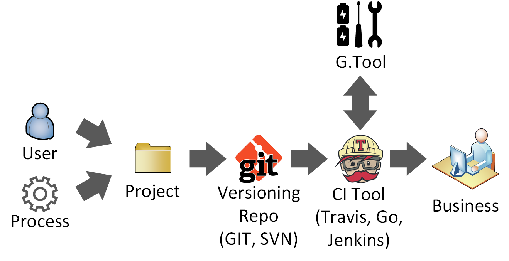

<!-- $theme: default -->

# Introducing G.Tool 

# 

### An open source framework for creating GRC tools </br> (:battery::battery: included)
</br>

 [/bsapiro](https://github.com/bsapiro)
 [@ironfog](https://twitter.com/ironfog)
 [sapiro](https://ca.linkedin.com/in/sapiro)

---
<!-- page_number: true -->
<!-- footer: G.Tool | SECTOR 2016 | CC BY-SA 4.0 -->
# Outline
- Backstory
- Overview
- Demo
- Ask for help

---
# TL;DR
G.Tool is an open source, batteries included, framework for non-programmers to build their own GRC (Governance, Risk & Compliance) tools without having to write code.

Go here :arrow_right: https://github.com/gtoolframework/ and get started. I need help so please files bugs, make suggestions, submit Pull Requests.

---
# Quick rant
open source = better infosec/cybersecurity 

---
<center>
<H1>Backstory</H1>
<H6>(in which I attempt, through narrative, to convince you I had a good idea)</H6>
</center>

---
# Origin story
_A long time ago in a galaxy at least 2.5 million light years away and completely dissimilar to our own although with a dominant species apparently identical to Homo Sapiens save for some pseudo-science about psychic powers..._

---
# Origin story
During my employer's first ever SOC2 audit my team was managing evidence via Excel, storing hundreds of files on sharepoint and collaborating on control documentation in Word. It did not go well and if I was the angry type it might have ended poorly...

---
# I had a problem
###### (actually I had several...)

* Office documents have varying levels of change tracking and varying levels of brokeness when doing collaborative editing
* Tracking hundreds of pieces of evidence without structure or tagging didn't work
* I had no budget for a COTS GRC tool (run rate matters at SaaS companies) and most GRC tools are overengineered / too expensive to own
* Even if I had the money, our IT department had a massive backlog and my team wasn't equipped to run servers
* Our auditors are "committed" to working in Excel and Word :expressionless:

---
# So I did something (stupid)...
... I built my own purpose specific GRC tool.

It was called **SOC2Tool** (our marketing department was busy that day)

---
# SOC2TOOL
* Principles, Controls, Risks and Evidence were documented in normal text files
* Changes tracking was provided by an existing code repository (GitHub enterprise already used by our dev org)
* Hand crafted artisinal python code converted the data structure into auditor friendly Excel spreadsheets and Word documents (and packaged up evidence into massive zip files)
* Not open source (it would have not met my employer's quality standards for an opensource release)
* Tightly coupled with our specific business requirements
* Used YAML (people are not good at YAML) :disappointed:

---
blurry cam for the next few slides

---
# SOC2TOOL Workflow #1


---
# SOC2TOOL Workflow #2


---
# SOC2TOOL Workflow #3


---
# SOC2TOOL Workflow #4


---
it worked (barely) but it got me thinking :thought_balloon: 

---
# General purpose GRC tools are...
* expensive :dollar::dollar::dollar::dollar::dollar::dollar::dollar::dollar::dollar::dollar::dollar::dollar::dollar::dollar::dollar::dollar:
* take a lot ot work to deploy :dollar::dollar::dollar::dollar::dollar::dollar::dollar::dollar::dollar:
* are underutilized

---
what if we focused on making something small?

---
could we embrace the Unix Philosophy of **[Do One Thing and Do It Well](https://en.wikipedia.org/wiki/Unix_philosophy#Do_One_Thing_and_Do_It_Well)**?

---
could we create small purpose specific GRC tools?

---
could we create the equivalent of **GREP, SED, AWK** for GRC?

---
yes, but every user has slightly different use cases

---
how do we account for slightly different use cases?

---
could I create a framework for making GRC tools?

---
could I make something for security pros like  **Ruby on Rails**
for building their own GRC tools?

---
yes, but unfortunately most security professionals are not coders
(this is especially true in the GRC space)

---
could I make something for security pros like   **Minecraft**
for building their own GRC tools?

---
yes, but I'm bad at GUI design (and I hate using a mouse)

---
<center>
<H1>Overview of G.Tool</H1>
<H6>This will all be covered in docs (promise)</H6>
</center>
 
---
#### G.Tool is a GRC tool framework with these design objectives:
* Accessible to non-developers and non-system admins
* Configuration and data entry using a simple text editor
* Works on any desktop operating system (no infrastructure)
* Supports collaborative editing
* Benefits from common tools in your environment
* Composable (put stuff together out of defined parts)
* Data structures work with existing operating system tools
* Data structure is accessible to other tools (without an API)
* Is extensible using plugins

---
#### G.Tool is a...
* command line tool
* framework (simple language and data structure) for users to create purpose specific GRC tools
* runs the tools created with framework

---
#### G.Tool folder structure


---
#### G.Tool processing workflow


<!-- read the configuration file, load plugins (global and project), Load data structures (/classes) load data aggregators /aggregates -->

---
_Note:_ *Release 1* of G.Tool was built to at least achieve parity with at least Excel (the defacto standard for GRC) but it is far more capable. 

---
<center>
Say hello to G.Tool
</center>

---


---
# Use Case #1 - Risk Register


---
# Use Case #1 - Risk Register
G.Tool Demo

---
## But Word and Excel have change tracking!

... yeah, but's it broken
* You can turn it off
* It works slightly differently across versions
* It doesn't allow you to see just a revision specific set of changes
* Sometimes it can't handle large volumes of changes
* Undoing bad changes is manual

---
# Use Case #2 - Vulnerability Remediation


---
# Use Case #2 - Vulnerability Remediation
show slicer, nodename, num (with range), Date

---
# Use Case #3 - Attack Tree
<center></center>

---
# Use Case #3 - Attack Tree
demonstrate attacktree plugin

---
# Use Case #4 - Continuous Compliance



---
# CI Tools provide dashboards


---
# The roadmap

<table>
<tr><td width=25%>Release 2</td><td width=25%>Release 3</td><td width=25%>Release 4</td><td width=25%>Release 5</td></tr>
<tr><td>Single click installer</td><td>Visual Code editor</td><td>Repo of common use cases</td><td>Common compliance standards repo</td></tr>
<tr><td>Nessus import plugin</td><td>Word output plugin</td><td>Dashboard plugin</td><td>Email output plugin</td></tr>
</table>

... plus bugfixes and improvements on existing code

---
# I need your help please:
###### (and my wife has been understanding over the past four months)
* Users to start working with G.Tool so that it can be improved through feedback
* People to identify use cases
* Contributors to the plugin library and the core code
* DevOps type folk to help with integrations

---
# Getting started
1) Install Python 3.5+
2) (Advanced) create a python virtual environment
3) Install G.Tool: ```pip install gtool```
4) Make a new gtool project: ```gtool create <foldername>```
5) (Optional) install git and ```git init```
6) Edit files ```gtool.cfg```, ```\classes\``` and ```\data\``` with a text editor of your choice
7) (Optional) ```git add .``` and ```git commit -m "my first gtool project"```
8) Run G.Tool ```gtool process --scheme <schemename> --output <outfile> <projectfolder>```

---
# Observations along the way
* Modern software development is complex  = Greater empathy for developers
* MVP is king (Should have started way earlier)
* MOAR Testing (test every change and retest earlier changes)
* Debugging code is HARD (but tools help)!!! **Incremental changes are imperative** 

---
<center>


This presentation was made using a text only tool called <a href=https://github.com/yhatt/marp>MARP</a>
<H6>(ok... not the pictures, those were drawn with a crayon)</H6>
</center>

---
Thank you to my wonderful wife for handling everything else while I focused on G.Tool for the last four months. She's been a true partner through this journey. :heart:

---
## Download G.Tool today!


### https://github.com/gtoolframework/

###### Copyright &copy; 2016 Ben Sapiro
###### G.Tool (framework) is released under the [GPL v3.0 License](https://www.gnu.org/licenses/gpl-3.0.en.html).
###### This Presentation is released under the [Creative Commons Attribution-ShareAlike 4.0 International License](https://creativecommons.org/licenses/by-sa/4.0/)

